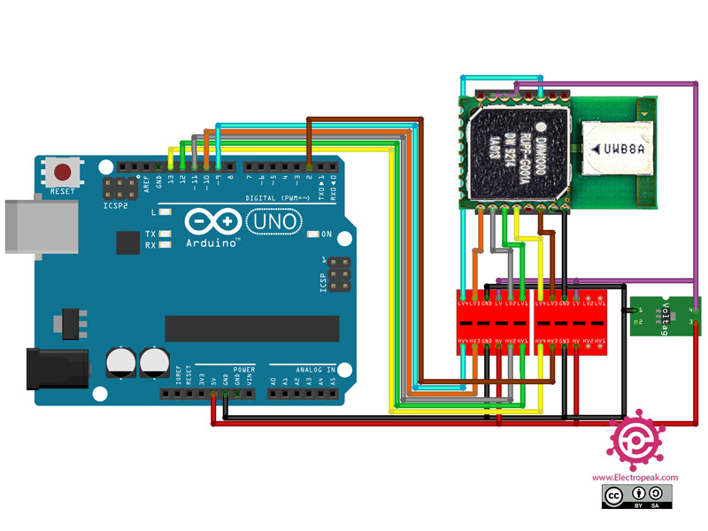

# Ali's Lab Notebook

## Project Overview
**Team Members:** Cedric Mathew, Ali Husain, Marsh Ma  
**Professor:** Arne Fliflet  
**TA:** Abhisheka Mathur Seka  

# 2024-01-25 - Brainstorming Session
**Ideas for our project**

1. Gesture ring - control your phone using a ring on your finger
2. Shower / Bath temperatur reader - figure out the temperature of your shower for accurate reading
3. Habit Forming Key Dish - Stop losing your keys at home. Keep them in one place

# 2024-02-10 - Figuring out parts for our design

This section details the role and functionality of each key component utilized in the Habit Forming Key Station project.

## ATtiny84A - Microcontroller (Microchip Technology)

- **Function:** Serves as the central processing unit of the project, managing input from sensors and controlling output to various devices. It executes the embedded software that dictates the behavior of the system, including signal processing, decision making, and communication with other electronic components.
- **Cost:** $1.62

## CMS-251472-24SP - Speaker (CUI Devices)

- **Function:** Outputs audible signals as part of the user interface. It can be used to provide feedback when a key is detected, alert users of system states, or issue warnings.
- **Cost:** $1.19

## SEN-09376 - Pressure Sensor (Interlink Electronics)

- **Function:** Measures the weight of the keys placed on the sensor to confirm their presence. This component is crucial for the Confirmation Subsystem, which detects and verifies the specific weight range of keys to activate or deactivate system features.
- **Cost:** $12.50

## L6R12-120 - Power Adapter (Tri-Mage, LLC)

- **Function:** Provides a stable power supply to the system, converting AC power from a standard wall outlet to a regulated DC voltage suitable for the electronics.
- **Cost:** $10.08

## LM1117T-3.3 - Voltage Regulator (Texas Instruments)

- **Function:** Ensures that the electronic components receive a constant, stable voltage despite variations in input power. This helps protect sensitive components and ensures reliable operation.
- **Cost:** $1.69

## DWM1000 - RF Transceiver (Qorvo)

- **Function:** Facilitates wireless communication within the system, particularly in the Proximity Detection Subsystem. This component is used to measure the distance to and from the key fob, enabling the system to detect when the keys are within a predefined range.
- **Cost:** $17.50

## COM-10440 ROHS - Button (Sparkfun)

- **Function:** Acts as a user interface element for manual input, allowing users to interact directly with the system, such as confirming an action or resetting the system state.
- **Cost:** $2.25

## CAB-14166 ROHS - Wire for Button (Sparkfun)

- **Function:** Connects the button to the microcontroller, providing the physical link through which button presses can be detected and processed by the system.
- **Cost:** $2.10

This lab notebook documents the design, development, and testing of the Habit Forming Key Station, focusing on sourcing and ordering parts and detailing the control and processing subsystem.

## January 20th - February 3rd
**Objective:** Identify and order necessary components for the initial prototype.

**Activities:**
- Conducted a component feasibility study to ensure availability and compatibility with our design requirements.
- Placed orders for the following parts:
  - ATmega328P microcontrollers from Microchip Technology, selected for their ease of use and extensive support in the hobbyist community.
  - Basic electronic supplies such as resistors, capacitors, and breadboards from Digikey.
  - Specialty sensors and input devices from Mouser Electronics.

**Decisions:**
- Opted for Arduino Uno for early phase testing due to its widespread use and support for rapid prototyping.
- Selected suppliers based on delivery times, cost, and component quality.

**Challenges:**
- Some parts were on backorder (button), requiring us to find alternative suppliers or adjust our design specifications slightly.

**Figures:**

- Figure 1: Block diagram of the design we created

### March 1st - March 14th
**Objective:** Begin assembly and initial testing of the control and processing subsystem.

**Activities:**
- Assembled the basic circuit on a breadboard integrating the Arduino Uno with the ATmega328P.
- Conducted initial tests to ensure basic functionality, such as reading from the pressure sensor and activating the alarm based on sensor input.

**Issues Faced:**
- Integration issues between the pressure sensor and the Arduino required troubleshooting the circuit connections and modifying resistor values.
- Delays in part delivery disrupted our planned schedule.

**Diagrams:**

- Figure 2: Breadboard setup with labeled connections between the transceiver and arduino uno

### March 14th - March 28th
**Objective:** Finalize the control and processing subsystem and prepare for mid-term presentation.

**Activities:**
- Completed the integration of the control and processing subsystem with the proximity detection and alarm subsystems.
- Prepared and rehearsed the mid-term presentation, focusing on design choices and preliminary testing results.

**Achievements:**
- Successfully demonstrated a working prototype during the mid-term review, receiving positive feedback and constructive critiques.

### April 2nd - April 15th
**Objective:** Complete final testing and prepare for project demonstration.

**Activities:**
- Conducted extensive reliability testing to ensure the system performs under various environmental conditions.
- Finalized the demonstration setup, practicing the sequence of operations and troubleshooting potential issues.

**Results:**
- The system consistently performed as expected across all tests, confirming readiness for the final presentation and demo.

**Demonstration Prep:**

- Figure 6: Final project setup

---
