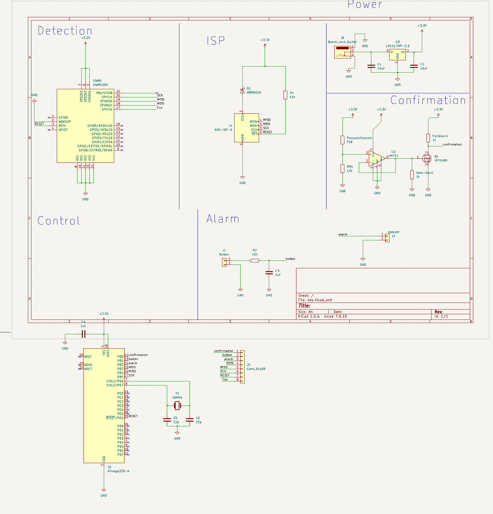
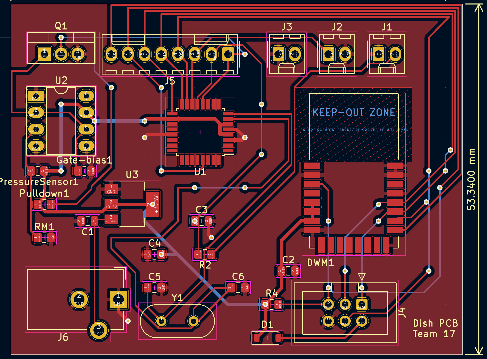
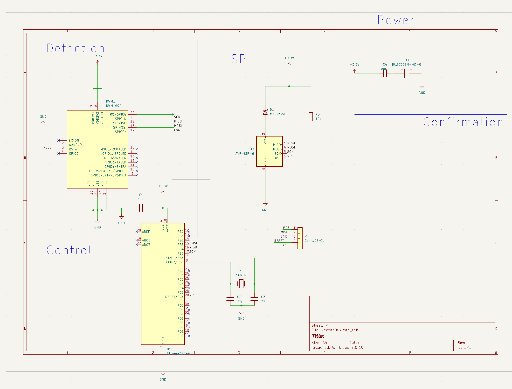
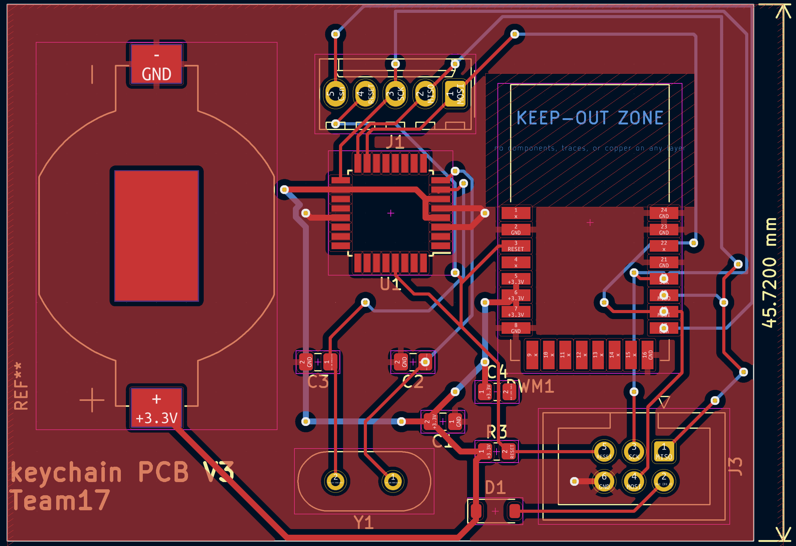

# Marsh's Project Working Log: Habit Forming Key Station

[[_TOC_]]

# 2024-03-05 - Initial PCB Design

Activities:

* Began initial design of the PCB tailored for supporting both subsystems.
* Selected and placed components on the schematic, focusing on a compact and efficient layout.

Progress:

* Completed the initial draft of the PCB schematic.

Changes Made:

* Switched from using a general-purpose microcontroller to a more power-efficient model better suited for real-time processing requirements.

# 2024-03-10 - PCB Layout Adjustments

Activities:

* Adjusted the PCB layout to optimize the routing of traces for power distribution and signal integrity.

Progress:

* Identified optimal trace widths and clearances to minimize noise and cross-talk between high-frequency components.

Changes Made:

* Moved the location of the power regulator to reduce electromagnetic interference with the Proximity Detection Subsystem.

This the schematic of our keydish PCB design

Front-side of our Keydish PCB design

And here are the schematic and front-side view of our keychain PCB:

# 2024-03-17 - Confirmation Subsystem Component Tuning

Activities:

* Tuned the voltage divider settings in the Confirmation Subsystem to enhance the detection accuracy of the FSR 406 sensor.

Progress:

* Successfully increased the subsystem's sensitivity to detect lighter objects resembling key weights.

Changes Made:

* Modified the resistor values in the voltage divider to adjust the output voltage range, improving sensor response time.

# 2024-03-20 - Proximity Detection Subsystem Calibration

Activities:

* Calibrated the DWM1000 module to fine-tune distance measurement accuracy.

* Implemented firmware updates to optimize data transmission between the key fob and station.

Progress:

* Achieved a consistent detection accuracy within the range of less than 1% error.

Changes Made:

* Adjusted the UWB pulse frequency to enhance detection through obstacles.

# 2024-04-01 - Integrated System Testing

Activities:

* Conducted integrated testing of both subsystems with the newly designed PCB to ensure compatibility and performance.

Progress:

* Both subsystems operated seamlessly with the new PCB layout.

Changes Made:

* Replaced the initial microcontroller firmware with a more robust version to handle edge cases in subsystem interactions.

# 2024-04-07 - Performance Optimization

Activities:

* Optimized the power management strategies to enhance the overall system's energy efficiency.

Progress:

* Reduced power consumption by 10% without compromising subsystem performance.

Changes Made:

*Integrated a new sleep mode protocol into the firmware to reduce idle power draw.

# 2024-04-21 - Final Preparations and Revisions

Activities:

* Made final adjustments to the subsystems based on feedback from trial runs.
* Prepared the documentation and presentation materials for project demonstration.

Progress:

* System is fully operational with all functionalities meeting the project's specifications.

Changes Made:

* Increased the robustness of the Confirmation Subsystem against false positives by refining the threshold settings.

