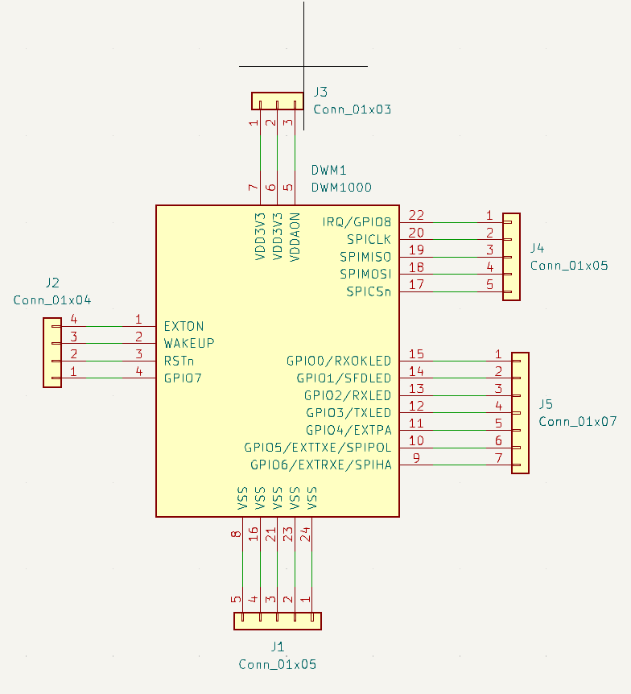
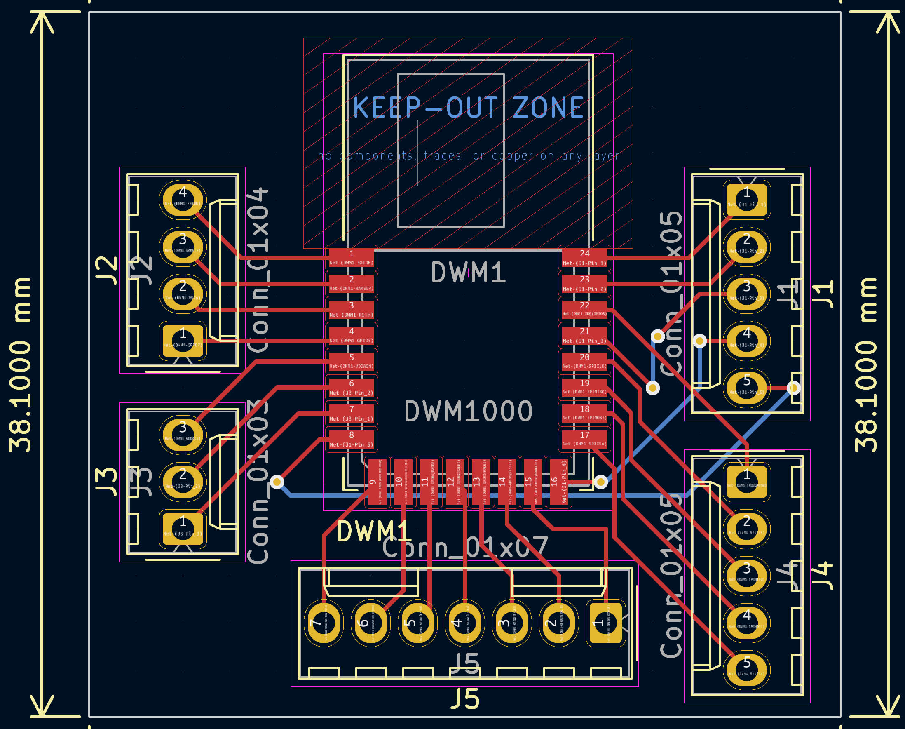

# Marsh's Project Working Log: Habit Forming Key Station

[[_TOC_]]

# 2024-03-05 - Initial PCB Design

Activities:

* Began initial design of the PCB tailored for supporting both subsystems.
* Selected and placed components on the schematic, focusing on a compact and efficient layout.

Progress:

* Completed the initial draft of the PCB schematic.

Changes Made:

* Switched from using a general-purpose microcontroller to a more power-efficient model better suited for real-time processing requirements.

# 2024-03-10 - PCB Layout Adjustments

Activities:

* Adjusted the PCB layout to optimize the routing of traces for power distribution and signal integrity.

Progress:

* Identified optimal trace widths and clearances to minimize noise and cross-talk between high-frequency components.

Changes Made:

* Moved the location of the power regulator to reduce electromagnetic interference with the Proximity Detection Subsystem.

This the schematic of our keydish PCB design

Front-side of our Keydish PCB design

And here are the schematic and front-side view of our keychain PCB:

# 2024-03-17 - Confirmation Subsystem Component Tuning

We are using [FSR 406](https://www.interlinkelectronics.com/fsr-406) as our pressure sensor. 
[operational amplifier](https://www.ti.com/lit/ds/symlink/lm741.pdf)
[MOSFET](https://media.digikey.com/pdf/Data%20Sheets/Fairchild%20PDFs/IRF540N.pdf)

Activities:

* Tuned the voltage divider settings and integrated additional circuit components to enhance the detection accuracy of the FSR 406 sensor in the Confirmation Subsystem. Reviewed the force-resistance characteristics and voltage response graphs to optimize the resistor value for our specific application of detecting key weights between 45g and 55g.

Technical Insights:

* The resistance versus force graph provided in the sensor's datasheet was instrumental in understanding how the FSR 406's resistance decreases logarithmically as applied force increases. This insight was crucial for accurately setting up our voltage divider circuit.
* From the voltage output versus force graph for various RM values, we identified that a 100K Ohms resistor provided the optimal sensitivity and voltage output for our target range of 45g to 55g. This selection ensures that small changes in force within this narrow range result in discernible voltage changes, suitable for reliable key detection.

Circuit Integration:

* To further enhance the signal processing, an [operational amplifier (op-amp)] was added to the circuit. This op-amp serves to amplify the voltage output from the voltage divider, providing a stronger and more stable signal for the microcontroller to process.
* A MOSFET was incorporated to act as a switch controlled by the output voltage from the op-amp. This setup allows the circuit to trigger other system actions, such as turning off an alert or activating a status LED, once the keys are detected on the sensor.

Progress:

* The finalized circuit configuration, including the FSR 406 with a 100K Ohms RM, op-amp for signal amplification, and MOSFET for effective load switching, was tested with simulated key weights. The tests confirmed the circuit's capability to accurately and consistently detect weights within the specified range.

Challenges:

* Balancing the amplification level to avoid saturation while ensuring the circuit remains responsive to the designated force range was a complex task. Initial configurations required adjustments to the op-amp gain settings to achieve this balance.

Changes Made:

* Finalized the RM value at 100K Ohms after testing various configurations, which proved to be most effective for our application range.
Adjusted the op-amp gain and refined the MOSFET triggering threshold to improve the overall responsiveness and reliability of the system.

Next Steps:

* Implement a series of long-duration stability tests to ensure the circuit maintains its accuracy and reliability over time and under different environmental conditions.
* Document the circuit design details, including schematics and component specifications, for the final project report and upcoming presentations.

# 2024-03-20 - Proximity Detection Subsystem Calibration

Activities:

* Calibrated the DWM1000 module to fine-tune distance measurement accuracy.

* Implemented firmware updates to optimize data transmission between the key fob and station.

Progress:

* Achieved a consistent detection accuracy within the range of less than 1% error.

Changes Made:

* Adjusted the UWB pulse frequency to enhance detection through obstacles.

To test the transcievers using arduino and breadboard, I designed an adaptor board for the transceiver, which is shown below

# 2024-04-01 - Integrated System Testing

Activities:

* Conducted integrated testing of both subsystems with the newly designed PCB to ensure compatibility and performance.

Progress:

* Both subsystems operated seamlessly with the new PCB layout.

Changes Made:

* Replaced the initial microcontroller firmware with a more robust version to handle edge cases in subsystem interactions.

# 2024-04-07 - Performance Optimization

Activities:

* Optimized the power management strategies to enhance the overall system's energy efficiency.

Progress:

* Reduced power consumption by 10% without compromising subsystem performance.

Changes Made:

*Integrated a new sleep mode protocol into the firmware to reduce idle power draw.

# 2024-04-21 - Final Preparations and Revisions

Activities:

* Made final adjustments to the subsystems based on feedback from trial runs.
* Prepared the documentation and presentation materials for project demonstration.

Progress:

* System is fully operational with all functionalities meeting the project's specifications.

Changes Made:

* Increased the robustness of the Confirmation Subsystem against false positives by refining the threshold settings.

